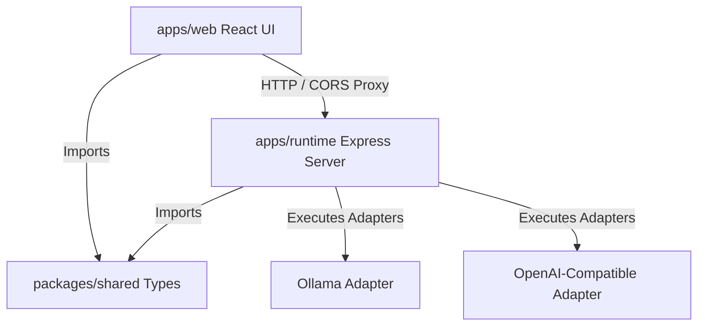

# Aster Code Architecture

Aster Code is built as a modular TypeScript monorepo using npm workspaces for type safety and compilation consistency.

## System Layout

### `packages/shared`
Holds compiler-safe configurations, standard TypeScript interfaces, and shared capabilities tags.
- Contains the schemas for `ModelMetadata`, `ProviderInfo`, `ChatMessage`, and `AgentActivityStep`.

### `apps/web`
React client compiled with Vite. Includes:
- Sidebar panel routing the active workspace views.
- **TopBar**: Dynamic model picker query.
- **Chat Studio**: Simulated steps execution timeline and prompts.
- **Workbench**: Live web preview panel, mock editor pane, and terminal console logs.
- **Model Registry**: Capability checks (Vision, Tool Use, etc.) for configured providers.
- **Settings**: Local endpoint urls and user templates saved to local storage.

### `apps/runtime`
Express-based server routing:
- `/health`: Verify server synchronization states.
- `/providers`: Fetch list of model adapters (configured or needed).
- `/models`: Load aggregated model specifications.
- `/models/refresh`: Trigger active adapter listing queries.
- `/config`: Update registry options (such as local ports, cloud keys) in memory.
