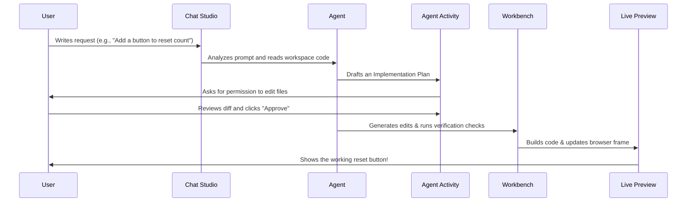

# Vibe Coding Pair-Programming Workflow

Aster Code is designed to make coding accessible, clean, and interactive. As a beginner, here is how you pair program with your AI agent using the "Vibe Coding" workflow.

## The Pair-Programming Loop

## Tips for AI Pair Programming

1. **Start with Small Vertical Slices**:
   Instead of asking the agent to "build a whole shop dashboard", ask it to "create a simple product list component". Verify it works, then ask to "add search functionality".

2. **Always Review Implementation Plans**:
   Before letting the agent edit files, check the suggested plan list in the chat. It ensures both you and the agent are aligned on what files are modifying.

3. **Verify via Live Previews**:
   Use the Workbench screen to monitor console outputs and browser frames. If something looks broken, copy the error logs from the terminal panel directly into the Chat Studio.

4. **Keep System Prompts Specific**:
   Under Settings, set your system prompt default based on your goal. Use a "Strict Beginner Tutor" style when learning concepts, or a "Senior Architect" style when writing production-grade modules.
